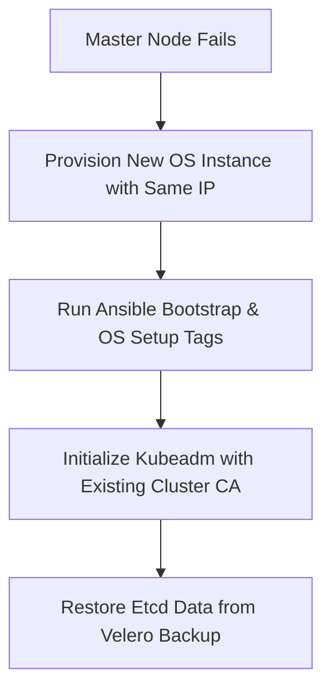

# 📖 Production Kubernetes Platform — Master Runbook & Debugging Guide

This document serves as the official operational manual and diagnostic guide for the **sriitservices** production Kubernetes platform. It contains step-by-step procedures (runbooks) and troubleshooting workflows (debugging guides) organized across all 11 architectural layers of the cluster.

---

## 🔍 Global Diagnostic Cheat Sheet

Before diving into layer-specific instructions, use these commands to assess the health of the host nodes and the cluster control plane.

```bash
# 1. Cluster & Node Health
kubectl cluster-info
kubectl get nodes -o wide
kubectl get componentstatuses

# 2. Check for Non-Running or Failed Pods (Cluster-wide)
kubectl get pods -A --field-selector status.phase!=Running,status.phase!=Succeeded

# 3. View Recent Cluster Events Ordered by Time
kubectl get events -A --sort-by='.metadata.creationTimestamp'

# 4. Inspect Kubelet Logs on a Master or Worker Node
systemctl status kubelet
journalctl -u kubelet -n 100 -f --no-pager

# 5. Inspect Containerd Runtime Status
systemctl status containerd
journalctl -u containerd -n 100 -f --no-pager

# 6. View Pod Events & Description
kubectl describe pod <pod-name> -n <namespace>
```

---

## 🏗 Layer 1: Cluster Foundation

### Components & Architecture
* **OS Baseline**: Ubuntu 22.04 LTS (Swap disabled, custom kernel modules and sysctl configuration)
* **Container Runtime**: `containerd` (with `SystemdCgroup` enabled)
* **K8s Node Agents**: `kubeadm` (bootstrapping), `kubelet` (agent), `kubectl` (CLI)
* **CNI Plugin**: `Calico v3.27.3` (providing pod networking via VXLAN routing)

---

### 📘 Operational Runbook

#### 1. Checking Control Plane Cert Expiration
Kubernetes control plane certificates generated by `kubeadm` expire after 1 year. Check expiration using:
```bash
kubeadm certs check-expiration
```

#### 2. Renewing Control Plane Certificates Manually
If certificates are close to expiration:
```bash
# Renew all certificates
kubeadm certs renew all

# Restart control plane static pods to apply changes
sudo systemctl restart kubelet
```

#### 3. Refreshing the Admin Kubeconfig
After renewing certificates, update your local administrative kubeconfig:
```bash
sudo cp /etc/kubernetes/admin.conf ~/.kube/config
sudo chown $(id -u):$(id -g) ~/.kube/config
chmod 600 ~/.kube/config
```

#### 4. Generating a New Worker Join Token
Tokens expire after 24 hours. Generate a new join command for worker nodes:
```bash
kubeadm token create --print-join-command
```

---

### 🛑 Debugging & Failure Modes

#### Failure Mode 1: Node Status Shows `NotReady`
* **Symptoms**: Running `kubectl get nodes` shows worker nodes in `NotReady` status.
* **Diagnostics**:
  1. Describe the node to inspect the conditions block:
     ```bash
     kubectl describe node <node-name>
     ```
     Check if `DiskPressure`, `MemoryPressure`, or `PIDPressure` is flagged `True`.
  2. SSH into the node and inspect kubelet logs:
     ```bash
     journalctl -u kubelet -n 100 --no-pager
     ```
  3. Verify the container runtime is running:
     ```bash
     systemctl is-active containerd
     ```
* **Mitigation**:
  * **Disk Pressure**: Run `crictl rmi --prune` to clean up unused container images. Check disk utilization using `df -h`.
  * **Memory/CPU Pressure**: Check for process resource exhaustion using `htop`.
  * **Runtime Crashes**: If containerd is down, restart it with `systemctl restart containerd`.

#### Failure Mode 2: Containerd Systemd Cgroup Driver Mismatch
* **Symptoms**: Kubelet fails to start, displaying logs about failing to establish connection to runtime or sandbox creation errors.
* **Diagnostics**:
  Search containerd logs for cgroup errors:
  ```bash
  journalctl -u containerd | grep -i cgroup
  ```
* **Mitigation**:
  Verify `/etc/containerd/config.toml` contains systemd cgroup settings:
  ```toml
  [plugins."io.containerd.grpc.v1.cri".containerd.runtimes.runc.options]
    SystemdCgroup = true
  ```
  If missing, update the file and restart containerd:
  ```bash
  sudo systemctl restart containerd
  sudo systemctl restart kubelet
  ```

#### Failure Mode 3: Calico IPAM Exhaustion / IP Address Leaks
* **Symptoms**: Pods remain stuck in `ContainerCreating` with errors like `no IP addresses available in pool` or `CNI IPAM allocation failed`.
* **Diagnostics**:
  1. Exec into a `calico-node` pod to check IPAM block allocations:
     ```bash
     kubectl exec -it -n kube-system daemonset/calico-node -c calico-node -- calicoctl ipam show --show-blocks
     ```
  2. Inspect if IP blocks are allocated to nodes that have since been removed or if they contain leaked IP records of deleted pods.
* **Mitigation**:
  * **Releasing Leaked IPs**: If you find leaked pod IPs, release them manually:
    ```bash
    kubectl exec -it -n kube-system daemonset/calico-node -c calico-node -- calicoctl ipam release --ip=<leaked-ip-address>
    ```
  * **Garbage Collection**: Force Calico's CNI IPAM garbage collection by restarting the kube-controllers:
     ```bash
     kubectl rollout restart deployment calico-kube-controllers -n kube-system
     ```

#### Failure Mode 4: Pod-to-Pod Communication Blocked Across Nodes (BGP Peering Broken)
* **Symptoms**: Pods on worker-01 cannot ping or reach pods on worker-02, causing application timeouts and database connection failures across nodes.
* **Diagnostics**:
  1. Check the BGP peering status from each node:
     ```bash
     kubectl exec -it -n kube-system daemonset/calico-node -c calico-node -- calicoctl node status
     ```
     Verify that `BGP PEERING` shows `Established` for all nodes. If the status is `Active` or `Start`, peering is broken.
  2. Test BGP connection port `179` (TCP) between nodes:
     ```bash
     nc -zvw 3 192.168.1.101 179
     ```
  3. Inspect node routes: `ip route show` should contain routes through the interface `vxlan.calico` (if VXLAN is used) or `tunl0` (if IP-in-IP is used).
* **Mitigation**:
  * **Firewall rules**: If port 179 is blocked, allow BGP traffic in your local node firewalls:
     ```bash
     sudo ufw allow proto tcp from 192.168.1.0/24 to any port 179
     ```
  * **VXLAN Port Verification**: If VXLAN is active (configured in `all.yml`), ensure UDP port `4789` is open between nodes.
  * **CNI Interface Binding**: If nodes have multiple interfaces, Calico may bind to the wrong interface. Edit the Calico DaemonSet configuration and set `IP_AUTODETECTION_METHOD` to `interface=eth0` or `kubernetes-internal-ip`.

#### Failure Mode 5: Network Timeouts on Large Payloads (MTU Mismatch)
* **Symptoms**: Small packets (like API calls) succeed, but large payloads (like database queries, heavy POST requests, or file uploads) hang and time out.
* **Diagnostics**:
  1. Inspect the host node MTU settings: `ip link show` (e.g. `eth0` is 1500).
  2. Check the Calico interface MTU settings: `ip link show | grep calico`.
  3. Under VXLAN mode, Calico MTU **must** be at least 50 bytes smaller than the physical network interface MTU (e.g., if host MTU is 1500, Calico interface must be <= 1450).
* **Mitigation**:
  1. Adjust the MTU in the Calico IPPool CRD:
     ```bash
     kubectl patch ippool default-ipv4-ippool --type='json' -p='[{"op": "replace", "path": "/spec/mtu", "value": 1450}]'
     ```
  2. Re-create Calico pods to apply:
     ```bash
     kubectl rollout restart daemonset calico-node -n kube-system
     ```

---

## 🌐 Layer 2: Load Balancing, Routing & TLS Automation

### Components & Architecture
* **MetalLB (v0.14.5)**: Layer 2 bare-metal load balancer allocating IPs from LAN pool `192.168.1.200–220`.
* **NGINX Ingress Controller (v4.15.1)**: Edge router handling TLS termination and routing.
* **cert-manager (v1.14.5)**: Provisions certificates via self-signed, internal, or Let's Encrypt CA.

---

### 📘 Operational Runbook

#### 1. Validating MetalLB LoadBalancer IP Allocation
```bash
kubectl get svc -n ingress-nginx ingress-nginx-controller
```
Ensure the `EXTERNAL-IP` is assigned an IP from the `192.168.1.200-192.168.1.220` range.

#### 2. Reviewing cert-manager ClusterIssuers
```bash
kubectl get clusterissuers -o wide
```
Verify the status of `selfsigned-issuer`, `letsencrypt-staging`, and `letsencrypt-prod`.

#### 3. Inspecting Certificate Statuses
```bash
kubectl get certificates -A
kubectl get certificaterequests -A
```

---

### 🛑 Debugging & Failure Modes

#### Failure Mode 1: Ingress Service Status Stuck in `<pending>`
* **Symptoms**: Ingress controller service shows `<pending>` for its External IP.
* **Diagnostics**:
  Check MetalLB controller and speaker logs:
  ```bash
  kubectl logs -n metallb-system -l app=metallb -c controller
  kubectl logs -n metallb-system -l app=metallb -c speaker
  ```
* **Mitigation**:
  Check if the IP range configured in the MetalLB `IPAddressPool` resource is fully occupied. Verify that the MetalLB CRDs match:
  ```yaml
  apiVersion: metallb.io/v1beta1
  kind: IPAddressPool
  metadata:
    name: ip-pool
    namespace: metallb-system
  spec:
    addresses:
      - 192.168.1.200-192.168.1.220
  ```

#### Failure Mode 2: Ingress Routing Returns `502 Bad Gateway` or `503 Service Unavailable`
* **Symptoms**: Browsing to a local service URL results in an NGINX error page.
* **Diagnostics**:
  1. Inspect Ingress controller access logs:
     ```bash
     kubectl logs -n ingress-nginx -l app.kubernetes.io/name=ingress-nginx --tail=50
     ```
  2. Verify backing service endpoints:
     ```bash
     kubectl get endpoints <service-name> -n <namespace>
     ```
* **Mitigation**:
  * **No Endpoints**: If the endpoints list is empty, check if the application pods are crashing or failing readiness probes.
  * **Port Mismatch**: Ensure the port defined in the Ingress resource matches the service target port.

#### Failure Mode 3: Certificates Stuck in `Ready: False`
* **Symptoms**: Cert-manager is unable to provision certificates, and connections display untrusted warnings.
* **Diagnostics**:
  ```bash
  # Check Certificate events
  kubectl describe certificate <cert-name> -n <namespace>
  # Check Challenge details
  kubectl get challenges -n <namespace>
  kubectl describe challenge <challenge-name> -n <namespace>
  ```
* **Mitigation**:
  * **HTTP-01 Challenge Failures**: Ensure Port 80 is open and routing correctly from the public internet to your NGINX Ingress controller. Let's Encrypt requires access to the challenge path (`http://<domain>/.well-known/acme-challenge/...`).
  * **Rate Limiting**: If Let's Encrypt rate limits are reached, temporarily switch the issuer annotation to `letsencrypt-staging` and re-test.

---

## 💾 Layer 3: Distributed & Object Storage

### Components & Architecture
* **Longhorn (v1.12.0)**: Block storage engine with data replication (configured with 2 replicas across worker nodes).
* **MinIO (v5.0.14)**: S3-compatible object storage used by Wiki.js, SonarQube, and Velero.

---

### 📘 Operational Runbook

#### 1. Monitoring Longhorn Volume Replication
Access the Longhorn UI via `https://longhorn.sriitservices.local` (uses Basic Authentication) or inspect volumes through `kubectl`:
```bash
kubectl get volumes.longhorn.io -n longhorn-system
```

#### 2. Creating an S3 Bucket in MinIO
Use the MinIO Console (`https://minio-console.sriitservices.local`) or the `mc` CLI:
```bash
# Configure mc client
mc alias set local-minio https://minio.sriitservices.local minioadmin Minio@Admin1! --insecure

# Create a new bucket
mc mb local-minio/new-app-bucket
```

---

### 🛑 Debugging & Failure Modes

#### Failure Mode 1: PVC Stuck in `Pending` Status
* **Symptoms**: PersistentVolumeClaim remains in `Pending` state, preventing pod creation.
* **Diagnostics**:
  Describe the PVC to view scheduling details:
  ```bash
  kubectl describe pvc <pvc-name> -n <namespace>
  ```
* **Mitigation**:
  * **StorageClass Mismatch**: Ensure the PVC specifies an active StorageClass (`longhorn`, `longhorn-fast`, or `longhorn-backup`).
  * **Replica Constraints**: `longhorn` is configured to keep 2 replicas. If only 1 node is healthy/active, Longhorn cannot satisfy scheduling.
  * **Safety Margin Triggered**: If the disk's free space falls below `storageMinimalAvailablePercentage: 5` on worker nodes, Longhorn blocks new allocations. Clean up disk space or expand node storage.

#### Failure Mode 2: Longhorn Volume Stuck in `Attaching` due to `Multipathd` Conflict
* **Symptoms**: Pods fail to mount volumes. Events show `VolumeAttachment` fails or loopback device creation is locked by host services.
* **Diagnostics**:
  Check node syslog / journald for `multipathd` taking ownership of the Longhorn block devices (`/dev/sdX` or `/dev/loopX` devices):
  ```bash
  sudo journalctl -u multipathd --no-pager | grep -i longhorn
  ```
* **Mitigation**:
  1. Exclude Longhorn block devices from host multipath management by editing `/etc/multipath.conf` on all host nodes:
     ```text
     blacklist {
         devnode "^sd[a-z0-9]+"
         devnode "^longhorn"
     }
     ```
  2. Restart the multipath service on the hosts:
     ```bash
     sudo systemctl restart multipathd
     ```

#### Failure Mode 3: Replica Divergence / Volume in `Degraded` State
* **Symptoms**: Longhorn UI shows warning `Degraded` or `Diverged` replicas, indicating replica syncing has stopped.
* **Diagnostics**:
  Query the replica custom resources:
  ```bash
  kubectl get replicas.longhorn.io -n longhorn-system
  ```
  Look for replicas with health state `Failed` or showing mismatching file sizes.
* **Mitigation**:
  1. Identify the unhealthy replica in the Longhorn UI or via `kubectl`.
  2. Safely delete the failing replica resource:
     ```bash
     kubectl delete replica <replica-name> -n longhorn-system
     ```
  3. Longhorn will automatically detect the replica count is below 2, provision a new replica block on another node, and perform a background sync.

#### Failure Mode 4: Filesystem Corruption / Mount Read-Only Mode
* **Symptoms**: Pods crash on start with `mount: /var/lib/kubelet/pods/...: can't read superblock` or the application throws `Read-only file system` errors during writes.
* **Diagnostics**:
  Check the worker node kernel ring buffer for filesystem errors:
  ```bash
  dmesg -T | grep -E "EXT4-fs|read-only"
  ```
* **Mitigation**:
  1. Scale down the application deployment to `0` replicas to detach the volume.
  2. Create a temporary diagnostics pod mounting the raw block device, or run `fsck` directly on the host node hosting the block device:
     ```bash
     # Find the block path under /dev/longhorn/ on the host node
     ls -l /dev/longhorn/pvc-*
     
     # Run ext4 filesystem check and repair
     sudo fsck.ext4 -y /dev/longhorn/pvc-<pvc-uuid>
     ```
  3. Once repaired, scale your application back to `1` replica.

---

## 🔀 Layer 4: API Gateway & Traffic Policy

### Components & Architecture
* **Kong Gateway OSS (v3.4.0)**: Handles proxy routing, rate-limiting, authentication, and headers.
* **Kong Manager OSS**: Web dashboard for administering routes (`https://kong-manager.sriitservices.local`).
* **Kong Admin API**: REST API for configuration (`https://kong-admin.sriitservices.local`).

---

### 📘 Operational Runbook

#### 1. Registering a Service & Route dynamically (Admin API)
```bash
KONG_ADMIN="https://kong-admin.sriitservices.local"

# Register service
curl -k -X POST $KONG_ADMIN/services \
  --data name=payment-service \
  --data url=http://payment-svc.default.svc.cluster.local:8080

# Register route
curl -k -X POST $KONG_ADMIN/services/payment-service/routes \
  --data 'paths[]=/payments' \
  --data 'strip_path=false'
```

#### 2. Enabling JWT Authentication on a Service
```bash
curl -k -X POST $KONG_ADMIN/services/payment-service/plugins \
  --data name=jwt
```

---

### 🛑 Debugging & Failure Modes

#### Failure Mode 1: Kong Gateway Returns `404 Route Not Found`
* **Symptoms**: Requests to `https://api.sriitservices.local/your-path` result in a 404 response from Kong.
* **Diagnostics**:
  Query the Admin API to verify the registered routes:
  ```bash
  curl -k https://kong-admin.sriitservices.local/routes
  ```
* **Mitigation**:
  * Check the value of the `Host` header in the request; Kong routes can be pinned to specific hostnames.
  * Verify the path prefix match logic. If `strip_path` is `true`, make sure the backend application is listening on the root path `/` instead of `/your-path`.

#### Failure Mode 2: Client Blocked by rate-limiting or ip-restriction
* **Symptoms**: Valid clients receive `429 Too Many Requests` or `403 Forbidden` responses.
* **Diagnostics**:
  Check response headers for rate-limiting status:
  ```http
  X-RateLimit-Remaining-Minute: 0
  ```
* **Mitigation**:
  * Adjust global limits in the Ansible group vars: `kong_plugins` includes `rate-limiting`.
  * For IP-restricted paths, verify that the ingress proxy configuration preserves the client's real IP address (`proxy_set_header X-Real-IP $remote_addr`).

---

## 📦 Layer 5: Registry & Security Guardrails

### Components & Architecture
* **Harbor Registry (v1.19.1)**: Stores container images and Helm charts. Performs auto-scanning via Trivy.
* **Trivy Operator (v0.33.2)**: Performs continuous vulnerability scanning of in-cluster resources.

---

### 📘 Operational Runbook

#### 1. Re-Scanning Images Manually
Log into the Harbor Web UI (`https://registry.sriitservices.local`), open the project repository, select the tag, and click **Scan**.

#### 2. Listing In-Cluster Vulnerability Reports
```bash
kubectl get vulnerabilityreports -A
```

---

### 🛑 Debugging & Failure Modes

#### Failure Mode 1: `x509: certificate signed by unknown authority` on image push/pull
* **Symptoms**: Docker or containerd fails to pull images from `registry.sriitservices.local`.
* **Diagnostics**:
  Check node logs for TLS handshake failures during pulling:
  ```bash
  journalctl -u containerd | grep registry.sriitservices.local
  ```
* **Mitigation**:
  1. Verify the certificate file exists on all nodes:
     * `/usr/local/share/ca-certificates/registry.sriitservices.local.crt`
     * `/etc/containerd/certs.d/registry.sriitservices.local/ca.crt`
  2. If missing, copy it and execute:
     ```bash
     sudo update-ca-certificates
     sudo systemctl restart containerd
     ```

---

## 🔧 Layer 6: DevOps Toolchain & Secret Management

### Components & Architecture
* **Gitea (v1.26.4)**: Private Git host with `act_runner` sidecar for Gitea Actions.
* **Woodpecker CI (v3.6.4)**: Pipeline executor configured with Gitea OAuth2.
* **ArgoCD (v9.7.0)**: GitOps continuous delivery engine.
* **SonarQube**: Code scanner.
* **OpenBao (v0.10.0)**: Community fork of Vault managing secrets and PKI.
* **Infisical**: Secrets dashboard.

---

### 📘 Operational Runbook

#### 1. Unsealing OpenBao after Node Restart
OpenBao requires manual unsealing whenever the `openbao-0` pod restarts.
```bash
# Retrieve keys from openbao-init-keys.json (saved locally during setup)
# Run the unseal command 3 times, passing a different key each time:
kubectl exec -n vault openbao-0 -- bao operator unseal <KEY_1>
kubectl exec -n vault openbao-0 -- bao operator unseal <KEY_2>
kubectl exec -n vault openbao-0 -- bao operator unseal <KEY_3>

# Verify unseal status
kubectl exec -n vault openbao-0 -- bao status
```

#### 2. Re-registering Gitea Actions Runner
If the actions runner fails to register:
1. Log into Gitea → **Site Administration** → **Actions** → **Runners**.
2. Click **Create New Runner** and copy the registration token.
3. Update `gitea_runner_registration_token` in `vault.yml` and run:
   ```bash
   ansible-playbook site.yml --tags gitea --ask-vault-pass
   ```

---

### 🛑 Debugging & Failure Modes

#### Failure Mode 1: SonarQube Fails to Start (Embedded ES virtual memory limit)
* **Symptoms**: SonarQube pod stuck in `CrashLoopBackOff` or `Error`.
* **Diagnostics**:
  Check the initialization container and application logs:
  ```bash
  kubectl logs -n devops -l app=sonarqube -c sonarqube --tail=100
  ```
  Look for the error: `max virtual memory areas vm.max_map_count [65530] is too low, increase to at least [262144]`.
* **Mitigation**:
  Run this sysctl command on all host nodes:
  ```bash
  sudo sysctl -w vm.max_map_count=262144
  # Ensure it persists across restarts
  echo "vm.max_map_count=262144" | sudo tee -a /etc/sysctl.d/99-kubernetes.conf
  ```

#### Failure Mode 2: Gitea Runners Fail to Pull/Build Docker Images
* **Symptoms**: Gitea Action job fails with `Docker socket connection refused`.
* **Diagnostics**:
  Ensure the DinD container is running alongside the runner pod:
  ```bash
  kubectl get pods -n devops -l app=gitea-act-runner -o jsonpath='{.items[*].status.containerStatuses}'
  ```
* **Mitigation**:
  The runner is designed to communicate with the DinD sidecar over a shared `emptyDir` socket directory. Verify the pod definition template contains the socket path `/var/run/docker.sock` shared between both containers.

---

## 🗄 Layer 7: State & Message Broker Databases

### Components & Architecture
* **PostgreSQL (v18.7.8)**: 1 primary + 2 read replicas.
* **Redis (v27.0.12)**: Sentinel mode with master/replica failover config.
* **RabbitMQ**: Persistent AMQP queue broker.

---

### 📘 Operational Runbook

#### 1. Checking PostgreSQL Replication Lag
Run the following inside the primary postgres pod:
```bash
kubectl exec -it -n databases postgresql-0 -- psql -U postgres -d postgres -c "SELECT client_addr, state, sync_state, sync_priority FROM pg_stat_replication;"
```

#### 2. Checking Redis Sentinel Master Status
```bash
kubectl exec -it -n databases redis-node-0 -c redis -- redis-cli -a Redis@Cache1! sentinel masters
```

---

### 🛑 Debugging & Failure Modes

#### Failure Mode 1: PostgreSQL Secondary Out of Sync
* **Symptoms**: Read replicas fail to receive updates or show errors in logs about missing WAL segments.
* **Diagnostics**:
  Check replication errors in logs:
  ```bash
  kubectl logs -n databases postgresql-read-replica-0
  ```
* **Mitigation**:
  If replication lag persists and the WAL log cannot catch up, force a resync:
  ```bash
  # Delete replica PVC to force a base backup restore on restart
  kubectl delete pod postgresql-read-replica-0 -n databases
  ```

#### Failure Mode 2: Redis Sentinel Split-Brain
* **Symptoms**: Multiple redis pods claim to be the primary master, or failover doesn't succeed during pod restarts.
* **Diagnostics**:
  Query each node to find who it believes is the current master:
  ```bash
  kubectl exec -it -n databases redis-node-0 -c redis -- redis-cli -a Redis@Cache1! info replication
  ```
* **Mitigation**:
  If Sentinel quorum is lost, scale down Sentinel and Redis statefulsets to `0`, then scale back up starting with the master pod to reset the configuration state.

---

## 📋 Layer 8: Log Aggregation (EFK Stack)

### Components & Architecture
* **ECK Operator**: Manages Elasticsearch deployment.
* **Elasticsearch (v8.15.3)**: Stores logs.
* **Kibana (v8.5.1)**: Log dashboard.
* **Fluent Bit**: System DaemonSet collecting container logs and shipping them to Elasticsearch.

---

### 📘 Operational Runbook

#### 1. Checking Elasticsearch Cluster Health
```bash
kubectl get elasticsearch -n logging
# Or query via curl internally
kubectl exec -it -n logging elasticsearch-es-default-0 -- curl -u elastic:password -k https://localhost:9200/_cluster/health
```

#### 2. Listing Fluent Bit Configmaps
```bash
kubectl get configmaps -n logging | grep fluent-bit
```

---

### 🛑 Debugging & Failure Modes

#### Failure Mode 1: Elasticsearch Status is RED
* **Symptoms**: Kibana cannot connect, logs are not being written, cluster state shows RED.
* **Diagnostics**:
  Get shard allocation status:
  ```bash
  kubectl exec -it -n logging elasticsearch-es-default-0 -- curl -u elastic:password -k https://localhost:9200/_cat/shards?v&h=index,shard,state,unassigned.reason
  ```
* **Mitigation**:
  * **Disk Watermark**: If disk space on a node hosting Elasticsearch exceeds the high watermark (usually 90%), ES changes the cluster to read-only mode. Increase the volume size of the Elasticsearch PVCs.
  * **Unassigned Shards**: Run the rerun reroute command to assign stuck shards:
    ```bash
    curl -XPOST -u elastic:password -k "https://localhost:9200/_cluster/reroute?retry_failed=true"
    ```

---

## 📊 Layer 9: Monitoring & Alerting

### Components & Architecture
* **Prometheus**: Time-series database scraping system and application metrics.
* **Grafana**: Graphical dashboard UI.
* **Alertmanager**: Dispatches alerts to Slack, webhooks, or email.

---

### 📘 Operational Runbook

#### 1. Inspecting Active Target Scraping Issues
Check Prometheus scrape targets:
```bash
kubectl get servicemonitors -A
```
Access the Prometheus Web UI at `https://prometheus.sriitservices.local` and go to **Status** → **Targets** to find failing endpoints.

#### 2. Injecting a Test Alert
Generate a synthetic alert to test Alertmanager notification pipelines:
```bash
# Exec into Prometheus pod and trigger alert rule evaluation or use Alertmanager API directly
```

---

### 🛑 Debugging & Failure Modes

#### Failure Mode 1: Prometheus TSDB Corruption (Pod crash loop)
* **Symptoms**: Prometheus pod remains in `CrashLoopBackOff` showing error `panic: write-ahead log contains invalid record`.
* **Diagnostics**:
  ```bash
  kubectl logs -n monitoring prometheus-kube-prometheus-stack-prometheus-0 -c prometheus --tail=50
  ```
* **Mitigation**:
  1. Exec into the container using a temporary utility pod, or clean up the WAL directory by mounting the PVC:
     ```bash
     # Delete the WAL directory to force rebuild
     rm -rf /prometheus/wal/*
     ```
  2. Restart the Prometheus statefulset pod.

---

## 🤝 Layer 10: Collaboration Suite

### Components & Architecture
* **Wiki.js (v2.2.20)**: Documentation wiki.
* **Mattermost (v6.6.101)**: Team collaboration chat.

---

### 🛑 Debugging & Failure Modes

#### Failure Mode 1: Wiki.js Git Storage Sync Fails
* **Symptoms**: Changes in Wiki.js are not being synced back to Gitea repositories.
* **Diagnostics**:
  Check logs for git authorization or SSH key access issues:
  ```bash
  kubectl logs -n collaboration -l app=wiki-js
  ```
* **Mitigation**:
  Ensure the Gitea personal access token configured in Wiki.js has write permissions on the target repository. If using SSH clone URLs, check that Gitea's SSH public key is trusted inside Wiki.js.

---

## 💾 Layer 11: Backup & Disaster Recovery

### Components & Architecture
* **Velero (v6.5.0)**: Cluster resource and volume snapshot utility backing up to MinIO.
* **rclone**: Daily CronJob syncing backup data from MinIO to OneDrive.

---

### 📘 Operational Runbook

#### 1. Creating a Manual Cluster Backup
```bash
velero backup create prod-backup-$(date +%Y%m%d) --include-namespaces databases,devops,harbor
```

#### 2. Restoring from a Backup
```bash
velero restore create --from-backup prod-backup-20260709 --include-namespaces databases
```

#### 3. Inspecting Sync Job Logs
Verify the OneDrive rclone sync executed successfully:
```bash
kubectl logs -n velero -l app=velero-onedrive-sync --tail=100
```

---

### 🛑 Debugging & Failure Modes

#### Failure Mode 1: Velero Backup Storage Location Shows `Unavailable`
* **Symptoms**: Velero commands report backups cannot be saved.
* **Diagnostics**:
  ```bash
  velero backup-location get
  ```
* **Mitigation**:
  Check if the backing MinIO instance is running and the bucket `velero-backups` exists. If credentials expired, update the secret `velero-s3-credentials` in the `velero` namespace.

#### Failure Mode 2: rclone OneDrive Sync Token Expired
* **Symptoms**: The daily cronjob logs show OAuth authentication failures.
* **Diagnostics**:
  ```bash
  kubectl logs -n velero jobs/velero-onedrive-sync
  ```
* **Mitigation**:
  1. Generate a new token using rclone locally on your workstation:
     ```bash
     rclone config
     # Follow the prompt and copy the JSON token string
     ```
  2. Encrypt and update the `velero_onedrive_token` variable in your Ansible `vault.yml`.
  3. Redeploy the Velero configuration tag:
     ```bash
     ansible-playbook site.yml --tags velero --ask-vault-pass
     ```

---

## 🚨 Disaster Recovery (DR) Playbook

### Scenario A: Complete Control Plane Failure (Single Master Down)
If the master node suffers a hardware failure, follow this procedure to restore control.



1. **Provision a new host** with the same IP address and hostname.
2. **Execute Ansible bootstrap**:
   ```bash
   ansible-playbook site.yml --tags "bootstrap,common,containerd,kubernetes_binaries" --ask-vault-pass
   ```
3. **Restore `etcd` configuration and CA certificates**:
   * If you have a backing `etcd` backup or host-level snapshot, restore `/etc/kubernetes/pki/` certificates first.
4. **Re-initialize the control plane node**:
   ```bash
   kubeadm init --config=/etc/kubernetes/kubeadm-config.yaml --ignore-preflight-errors=all
   ```

---

### Scenario B: Volume Storage Exhaustion (Longhorn Read-Only)
When worker node physical storage is completely filled, Longhorn locks volumes into read-only mode to prevent database corruption.

1. **Identify the affected node**:
   ```bash
   kubectl get nodes
   df -h
   ```
2. **Safely expand the volume size in Kubernetes**:
   Modify the YAML or Helm values and apply. Longhorn supports online volume expansion:
   ```yaml
   spec:
     resources:
       requests:
         storage: 20Gi # Increase from old size
   ```
3. **Verify the filesystem expansion** has completed:
   ```bash
   kubectl get pvc -n <namespace>
   ```

---

### Scenario C: Complete Cluster Reconstruction from Backup
In case of a total cluster loss where you need to rebuild on new hardware:

1. **Deploy the entire Ansible Playbook** to bootstrap nodes, networking, ingress, and the MinIO storage layer:
   ```bash
   ansible-playbook site.yml --ask-vault-pass
   ```
2. **Install Velero CLI** on your local machine and connect to the restored MinIO bucket.
3. **Execute Velero Restore**:
   ```bash
   velero restore create --from-backup <latest-onedrive-backup> --include-namespaces databases,devops,harbor
   ```
4. **Unseal OpenBao** manually using the keys saved in `openbao-init-keys.json`.
5. **Sync ArgoCD** to reconcile all running workloads back to their GitOps state.
